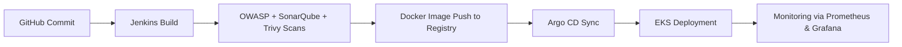

# SMS-APP Student Management System Javascript 🌍✈️

MERN stack app. Streamline school management, class organization, and add students and faculty. Seamlessly track attendance, assess performance, and provide feedback. Access records, view marks, and communicate effortlessly.


#

# Student Management System End to End Deployment CICD using Jenkins

#### Real Time Deployment, I will Show you how to deploy an end to end Real Time three tier MERN stack Application Using EKS cluster.
#
### <span style="background-color:FF9013;color:black">Project Deployment Flow:</span>


#
# 🧰 DevOps Toolchain Overview

## Tools We Are Going to Use

| **Category** | **Tool / Service** | **Purpose / Function** | **Detailed Usage in Pipeline** |
|---------------|--------------------|-------------------------|--------------------------------|
| **Source Code Management (SCM)** | **Git + GitHub** | Version control and source code repository | Used to store, version, and manage application code. All pipeline automation (Jenkinsfile, Dockerfile, Helm charts, manifests) is maintained in GitHub. Webhooks can trigger Jenkins builds on commits or pull requests. |
| **Containerization** | **Docker** | Packaging code and dependencies into lightweight containers | Application components (Frontend, Backend, Database, etc.) are containerized using Dockerfiles. Jenkins builds and pushes images to Docker Hub or ECR for deployment. |
| **Continuous Integration (CI)** | **Jenkins** | Automate build, test, and integration | Acts as the central CI server. Automatically builds Docker images, runs code quality and security checks, and pushes verified images to a container registry. |
| **Security Analysis** | **OWASP Dependency Check** | Scan for known vulnerabilities in project dependencies | Jenkins integrates OWASP Dependency-Check to identify outdated or vulnerable libraries before containerization. Reports are generated and archived in Jenkins. |
| **Code Quality Analysis** | **SonarQube** | Static code analysis and code quality metrics | Jenkins triggers a SonarQube scan on every build to evaluate code quality, maintainability, code smells, and technical debt. Fails builds if quality gates are not met. |
| **Vulnerability Scanning** | **Trivy** | Scan Docker images and filesystem for vulnerabilities | Jenkins uses Trivy to scan built Docker images before deployment. Vulnerability reports are generated and optionally sent to monitoring dashboards. |
| **Continuous Deployment (CD)** | **Argo CD** | GitOps-based continuous delivery to Kubernetes | Argo CD monitors GitHub repository for manifest/Helm changes. Automatically syncs changes to the target EKS cluster for deployment. |
| **Container Orchestration** | **AWS EKS (Elastic Kubernetes Service)** | Managed Kubernetes service for deploying containers | EKS hosts all deployed containers. Provides scalability, load balancing, and fault tolerance. Integrated with Argo CD for GitOps-driven deployment. |
| **Monitoring & Visualization** | **Helm** | Kubernetes package manager for deploying monitoring tools | Helm is used to deploy Grafana and Prometheus charts on EKS for cluster and application monitoring. |
| **Monitoring Tools** | **Prometheus + Grafana** | Metrics collection and visualization | Prometheus collects metrics from applications, nodes, and pods. Grafana visualizes data via dashboards for real-time system health and performance. |

---

## 🧩 CI/CD Flow (Simplified)



#### How pipeline will look after deployment:

- <b>Scanning code using DevSecOps and building and pushing image using CI-pipeline </b>


- <b> Updating K8s manifiest files Using CD-Pipeline </b>


- <b>ArgoCD application for deployment on EKS</b>


#
> [!Important]
> Below table helps you to navigate to the particular tool installation section fast.

| Tech stack    | Installation |
| -------- | ------- |
| Jenkins Master | <a href="#Jenkins">Install and configure Jenkins</a>     |
| eksctl | <a href="#EKS">Install eksctl</a>     |
| Argocd | <a href="#Argo">Install and configure ArgoCD</a>     |
| Jenkins-Worker Setup | <a href="#Jenkins-worker">Install and configure Jenkins Worker Node</a>     |
| OWASP setup | <a href="#Owasp">Install and configure OWASP</a>     |
| SonarQube | <a href="#Sonar">Install and configure SonarQube</a>     |
| Monitoring | <a href="#Monitor">Prometheus and grafana setup using helm charts</a>
| Clean Up | <a href="#Clean">Clean up</a>     |
#

### Pre-requisites to implement this project:
#

> [!Note]
> This project will be implemented on North California region (us-west-1).

- <b>Create 1 Master machine on AWS with 2CPU, 8GB of RAM (t2.large) and 29 GB of storage and install Docker on it.</b>
#
- <b>Open the below ports in security group of master machine and also attach same security group to Jenkins worker node (We will create worker node shortly)</b>


> [!Note]
> We are setting up this master machine to serve as the central control node, where we will configure Jenkins Master, install eksctl, and create the EKS cluster.

Use the following commands to install and configure Docker. Running newgrp docker applies the group changes immediately—no EC2 restart required.

```bash
sudo apt-get update
```
```bash
sudo apt-get install docker.io -y
sudo usermod -aG docker ubuntu && newgrp docker
```
#
- <b id="Jenkins">Install and configure Jenkins (Master machine)</b>
```bash
sudo apt update -y
sudo apt install fontconfig openjdk-17-jre -y

sudo wget -O /usr/share/keyrings/jenkins-keyring.asc \
  https://pkg.jenkins.io/debian-stable/jenkins.io-2023.key
  
echo "deb [signed-by=/usr/share/keyrings/jenkins-keyring.asc]" \
  https://pkg.jenkins.io/debian-stable binary/ | sudo tee \
  /etc/apt/sources.list.d/jenkins.list > /dev/null
  
sudo apt-get update -y
sudo apt-get install jenkins -y
```
- <b>Now, open your web browser and access the Jenkins Master on port 8080 to begin the configuration.</b>.
#
- <b id="EKS">Step: Create an EKS Cluster from the Master Machine</b>
  - Set up an IAM user with programmatic access (Access Key ID and Secret Access Key).
  - Install and configure the AWS CLI using those credentials.

  - Proceed with eksctl to create and manage your EKS cluster.

  ```bash

  #!/bin/bash
  curl "https://awscli.amazonaws.com/awscli-exe-linux-x86_64.zip" -o "awscliv2.zip"
  sudo apt install unzip
  unzip awscliv2.zip
  sudo ./aws/install
  aws configure
  ```

  ```bash
    
    #!/bin/bash

    curl -LO "https://dl.k8s.io/release/$(curl -L -s https://dl.k8s.io/release/stable.txt)/bin/linux/amd64/kubectl"
    chmod +x ./kubectl
    sudo mv ./kubectl /usr/local/bin
    kubectl version --short --client

  ```

  - Install **eksctl** (Master machine) Setup eksctl</a>
  
  ```bash
  curl --silent --location "https://github.com/weaveworks/eksctl/releases/latest/download/eksctl_$(uname -s)_amd64.tar.gz" | tar xz -C /tmp
  sudo mv /tmp/eksctl /usr/local/bin
  eksctl version
  ```
  
  - <b>Creating EKS Cluster on Master Machine</b>
  ```bash
  eksctl create cluster --name=smsapp \
                      --region=us-east-2 \
                      --version=1.30 \
                      --without-nodegroup
  ```
  - <b>Associate IAM OIDC Provider (Master Machine)
Run this step from the master machine to connect your EKS cluster with the IAM OIDC identity provider for role-based access.</b>

  ```bash
  eksctl utils associate-iam-oidc-provider \
    --region us-east-2 \
    --cluster smsapp \
    --approve
  ```
  - <b>Creating Node Groups on Master machine </b>
  ```bash
  eksctl create nodegroup --cluster=smsapp \
                       --region=us-east-2 \
                       --name=smsapp \
                       --node-type=t2.large \
                       --nodes=2 \
                       --nodes-min=2 \
                       --nodes-max=2 \
                       --node-volume-size=29 \
                       --ssh-access \
                       --ssh-public-key=eks-nodegroup-key 
  ```
> [!Note]
>  Verify that the SSH key pair eks-nodegroup-key exists in your AWS account before proceeding."
#
- <b id="Jenkins-worker">setup worker node for jenkins </b>
  Create a Jenkins Worker EC2 instance (t2.large, 2 vCPUs, 8 GB RAM, 29 GB storage) and install Java to prepare it for Jenkins agent use
  ```bash
  sudo apt update -y
  sudo apt install fontconfig openjdk-17-jre -y
  ```
  - Creating an IAM <span style="background-color:FF9013;color:black">administrator access</span> Associate it to the jenkins worker node <span style="background-color:FF9013;color:black">NOW Select Jenkins worker node EC2 instance --> Actions --> Security --> Modify IAM role</span>
  

  ```bash
  sudo su
  ```

  ```bash
  curl "https://awscli.amazonaws.com/awscli-exe-linux-x86_64.zip" -o "awscliv2.zip"
  sudo apt install unzip
  unzip awscliv2.zip
  sudo ./aws/install
  aws configure
  ```
#
  - <b>generate ssh keys (Master machine) to setup jenkins master-slave</b>
  ```bash
  ssh-keygen
  ```
  
#
  - <b>Now move to directory where your ssh keys are generated and copy the content of public key and paste to authorized_keys file of the Jenkins worker node.</b>
#
  - <b>Now, go to the jenkins master and navigate to <span style="background-color:FF9013;color:black">Manage jenkins --> Nodes</span>, and click on Add node </b>
    - <b>name:</b> Node
    - <b>type:</b> permanent agent
    - <b>Number of executors:</b> 2
    - Remote root directory
    - <b>Labels:</b> Node
    - <b>Usage:</b> Only build jobs with label expressions matching this node
    - <b>Launch method:</b> Via ssh
    - <b>Host:</b> \<public-ip-worker-jenkins\>
    - <b>Credentials:</b> <span style="background-color:FF9013;color:black">Add --> Kind: ssh username with private key --> ID: Worker --> Description: Worker --> Username: root --> Private key: Enter directly --> Add Private key</span>
    - <b>Host Key Verification Strategy:</b> Non verifying Verification Strategy
    - <b>Availability:</b> Keep this agent online as much as possible
#
  - And your jenkins worker node is added
  

# 
- <b id="docker">Install docker (Jenkins Worker)</b>

```bash
sudo apt install docker.io -y
sudo usermod -aG docker ubuntu && newgrp docker
```
#
- <b id="Sonar">Install and configure SonarQube (Master machine)</b>
```bash
docker run -itd --name SonarQube-Server -p 9000:9000 sonarqube:lts-community
```
#
- <b id="Trivy">Install Trivy (Jenkins Worker)</b>
```bash
sudo apt-get install wget apt-transport-https gnupg lsb-release -y
wget -qO - https://aquasecurity.github.io/trivy-repo/deb/public.key | sudo apt-key add -
echo deb https://aquasecurity.github.io/trivy-repo/deb $(lsb_release -sc) main | sudo tee -a /etc/apt/sources.list.d/trivy.list
sudo apt-get update -y
sudo apt-get install trivy -y
```
#
- <b id="Argo">Install and Configure ArgoCD (Master Machine)</b>
  - <b>Create argocd namespace</b>
  ```bash
  kubectl create namespace argocd
  ```
  - <b>Apply argocd manifest</b>
  ```bash
  kubectl apply -n argocd -f https://raw.githubusercontent.com/argoproj/argo-cd/stable/manifests/install.yaml
  ```
  - <b>Make sure all pods are running in argocd namespace</b>
  ```bash
  watch kubectl get pods -n argocd
  ```
  - <b>Install argocd CLI</b>
  ```bash
  sudo curl --silent --location -o /usr/local/bin/argocd https://github.com/argoproj/argo-cd/releases/download/v2.4.7/argocd-linux-amd64
  ```
  - <b>Provide executable permission</b>
  ```bash
  sudo chmod +x /usr/local/bin/argocd
  ```
  - <b>Check argocd services</b>
  ```bash
  kubectl get svc -n argocd
  ```
  - <b>Change argocd server's service from ClusterIP to NodePort</b>
  ```bash
  kubectl patch svc argocd-server -n argocd -p '{"spec": {"type": "NodePort"}}'
  ```
  - <b>Confirm service is patched or not</b>
  ```bash
  kubectl get svc -n argocd
  ```
  - <b> Check the port where ArgoCD server is running and expose it on security groups of a worker node</b>
  
  - <b>Access it on browser, click on advance and proceed with</b>
  ```bash
  <public-ip-worker>:<port>
  ```
  
  - <b>Fetch the initial password of argocd server</b>
  ```bash
  kubectl -n argocd get secret argocd-initial-admin-secret -o jsonpath="{.data.password}" | base64 -d; echo
  ```
  - <b>Username: admin</b>
  - <b> Now, go to <span style="background-color:FF9013;color:black">User Info</span> and update your argocd password

#
## Steps to implement the project:
- <b>Go to Jenkins Master and click on <span style="background-color:FF9013;color:black"> Manage Jenkins --> Plugins --> Available plugins</span> install the below plugins:</b>
  - OWASP
  - SonarQube Scanner
  - Docker
  - Pipeline: Stage View
#
- <b id="Owasp">Configure OWASP, move to <span style="background-color:FF9013;color:black">Manage Jenkins --> Plugins --> Available plugins</span> (Jenkins Worker)</b>


- <b id="Sonar">After OWASP plugin is installed, Now move to <span style="background-color:FF9013;color:black">Manage jenkins --> Tools</span> (Jenkins Worker)</b>

#
---
## Step 2: Create a Jenkins Token
- Go to **User Icon → My Account → Security**.  
- Under **Generate Tokens**, enter a name (e.g. `jenkins-sonarqube-token`) and click **Generate**.  
- **Copy** the token — it won’t be shown again.

---

## Step 3: Add SonarQube in Jenkins
### A. Add Server
- In Jenkins → **Manage Jenkins → System → SonarQube servers → Add SonarQube**  
- Fill in:  
- **Name:** `SonarQube`  
- **URL:** `https://192.168.43.192:30396`  
- **Token:** Select or add credentials.

### B. Add Token Credential
- Click **Add → Jenkins → Secret Text**.  
- Paste the token and set an ID (e.g. `sonarqube-token`).  
- Save and select this credential in SonarQube configuration.

---

✅ **Done!** Jenkins is now connected to SonarQube for code analysis.


# 🚀 Jenkins Setup Guide (with SonarQube, GitHub & Docker Integration)

This guide helps you set up Jenkins step-by-step to integrate with **SonarQube**, **GitHub**, and **Docker** for CI/CD pipelines.

---

## 🧱 Prerequisites
Before you begin, make sure:
- Jenkins is installed and running.
- SonarQube is installed and accessible.
- Docker is installed (if you plan to build/push images).
- You have a **GitHub Personal Access Token** (PAT).
- You have valid credentials for **Docker Hub**.

---

## 🪪 Step 1: Add SonarQube Credentials
1. In Jenkins, go to **Manage Jenkins → Credentials**.  
2. Click **Add Credentials**.  
3. Choose:
   - **Kind:** Secret text  
   - **Secret:** Paste your SonarQube token  
   - **ID/Name:** `sonarqube-token`
4. Click **Save**.

> 🔒 This token allows Jenkins to authenticate with SonarQube.

---

## 🧰 Step 2: Configure SonarQube Scanner
1. Navigate to **Manage Jenkins → Tools**.  
2. Scroll down to **SonarQube Scanner installations**.  
3. Click **Add SonarQube Scanner**.  
4. Give it a name (e.g., `sonar-scanner`).  
5. Optionally, install automatically from SonarQube’s download URL.  
6. Save your configuration.

---

## 🧑‍💻 Step 3: Add GitHub Credentials
1. Go to **Manage Jenkins → Credentials**.  
2. Click **Add Credentials**.  
3. Choose:
   - **Kind:** Username with password  
   - **Username:** Your GitHub username  
   - **Password:** Your **GitHub Personal Access Token (PAT)**  
   - **ID:** `github-token`
4. Click **Save**.

> 💡 Use your GitHub **Personal Access Token** instead of your account password.

---

## ⚙️ Step 4: Configure SonarQube Server
1. Go to **Manage Jenkins → System**.  
2. Scroll down to **SonarQube servers**.  
3. Click **Add SonarQube**.  
4. Provide:
   - **Name:** `SonarQube`
   - **Server URL:** e.g., `http://<your-sonarqube-server>:9000`
   - **Server authentication token:** Select the token added earlier.
5. Click **Save**.

---

## 📚 Step 5: Configure Global Pipeline Library (Optional)
1. Go to **Manage Jenkins → System**.  
2. Scroll to **Global Trusted Pipeline Libraries**.  
3. Click **Add**.  
4. Provide:
   - **Library Name** (e.g., `shared-libraries`)
   - **Default Version:** `main`  
   - **Retrieval method:** Modern SCM → Git  
   - **Repository URL:** your GitHub repo for shared libraries
5. Save changes.

---

## 🌐 Step 6: Create Webhook in SonarQube
1. Log in to your **SonarQube** dashboard.  
2. Go to **Administration → Configuration → Webhooks**.  
3. Click **Create**.  
4. Fill in:
   - **Name:** `Jenkins Webhook`
   - **URL:**  
     ```
     http://<your-jenkins-server>/sonarqube-webhook/
     ```
5. Click **Create**.

> 🔁 This allows SonarQube to notify Jenkins when code analysis is complete.

---

## 🐳 Step 7: Add Docker Credentials
1. Go to **Manage Jenkins → Credentials**.  
2. Click **Add Credentials**.  
3. Choose:
   - **Kind:** Username with password  
   - **Username:** Your Docker Hub username  
   - **Password:** Your Docker Hub token/password  
   - **ID:** `dockerhub-creds`
4. Save.

> 🧩 These credentials will be used to push images to Docker Hub.

---

## 🧪 Step 8: Create CI Pipeline
1. In Jenkins, go to the dashboard → click **New Item**.  
2. Enter a name, e.g., **SMS-Application-CI**.  
3. Select **Pipeline** and click **OK**.  
4. In the **Pipeline** section:
   - Choose **Pipeline script from SCM**.
   - Select **Git** as SCM.
   - Add your **repository URL** and select **GitHub credentials**.
   - Specify your branch (e.g., `main`).
5. Click **Save**.  
6. Run your first build with **Build Now**.

---

## ✅ Setup Complete
You’ve now configured Jenkins with:
- **SonarQube Integration**  
- **GitHub Authentication**  
- **Docker Push Access**  
- **Webhook Automation**

Your **CI pipeline (SMS-Application-CI)** is ready to build, analyze, and deploy your applications seamlessly. 🎉

---

### 🧩 Useful Links
- [Jenkins Official Docs](https://www.jenkins.io/doc/)
- [SonarQube Docs](https://docs.sonarsource.com/)
- [Docker Hub](https://hub.docker.com/)
- [GitHub Token Setup Guide](https://docs.github.com/en/github/authenticating-to-github/creating-a-personal-access-token)

---

### 🧠 Tips
- Regularly update Jenkins plugins.  
- Backup credentials and configuration files.  
- Use Jenkinsfiles in your repos for consistent pipelines.  


#
- <b>Create one more pipeline <span style="background-color:FF9013;color:black">SMS-Application-CD</span></b>


#
- <b>Provide permission to docker socket so that docker build and push command do not fail (Jenkins Worker)</b>
```bash
chmod 777 /var/run/docker.sock
```
#
- <b> Go to Master Machine and add our own eks cluster to argocd for application deployment using cli</b>
  - <b>Login to argoCD from CLI</b>
  ```bash
   argocd login 192.168.43.192:32791 --username admin
  ```
> [!Tip]
> 192.168.43.192:32791 --> This should be your argocd url

  - <b>Check how many clusters are available in argocd </b>
  ```bash
  argocd cluster list
  ```
  - <b>Get your cluster name</b>
  ```bash
  kubectl config get-contexts
  ```
  - <b>Add your cluster to argocd</b>
  ```bash
  argocd cluster add smsapp@smsapp.us-west-1.eksctl.io --name smsapp-eks-cluster
  ```
  > [!Tip]

  - <b> Once your cluster is added to argocd, go to argocd console <span style="background-color:FF9013;color:black">Settings --> Clusters</span> and verify it</b>
#
- <b>Go to <span style="background-color:FF9013;color:black">Settings --> Repositories</span> and click on <span style="background-color:FF9013;color:black">Connect repo</span> </b>


> [!Note]
> Connection should be successful

- <b>Now, go to <span style="background-color:FF9013;color:black">Applications</span> and click on <span style="background-color:FF9013;color:black">New App</span></b>


> [!Important]
> Make sure to click on the <span style="background-color:FF9013;color:black">Auto-Create Namespace</span> option while creating argocd application


- <b>Congratulations, your application is deployed on AWS EKS Cluster</b>


#
## How to monitor EKS cluster, kubernetes components and workloads using prometheus and grafana via HELM (On Master machine)
- <p id="Monitor">Install Helm Chart</p>
```bash
curl -fsSL -o get_helm.sh https://raw.githubusercontent.com/helm/helm/main/scripts/get-helm-3
```
```bash
chmod 700 get_helm.sh
```
```bash
./get_helm.sh
```

#
-  Add Helm Stable Charts for Your Local Client
```bash
helm repo add stable https://charts.helm.sh/stable
```

#
- Add Prometheus Helm Repository
```bash
helm repo add prometheus-community https://prometheus-community.github.io/helm-charts
```

#
- Create Prometheus Namespace
```bash
kubectl create namespace prometheus
```
```bash
kubectl get ns
```

#
- Install Prometheus using Helm
```bash
helm install stable prometheus-community/kube-prometheus-stack -n prometheus
```

#
- Verify prometheus installation
```bash
kubectl get pods -n prometheus
```

#
- Check the services file (svc) of the Prometheus
```bash
kubectl get svc -n prometheus
```

#
- Expose Prometheus and Grafana to the external world through Node Port
> [!Important]
> change it from Cluster IP to NodePort after changing make sure you save the file and open the assigned nodeport to the service.

```bash
kubectl edit svc stable-kube-prometheus-sta-prometheus -n prometheus
```

adminali@192.168.43.192:~$ kubectl edit svc stable-kube-prometheus-sta-prometheus -n prometheus service/stable-kube-prometheus-sta-prometheus edited

#
- Verify service
```bash
kubectl get svc -n prometheus
```

#
- Now,let’s change the SVC file of the Grafana and expose it to the outer world
```bash
kubectl edit svc stable-grafana -n prometheus
```


#
- Check grafana service
```bash
kubectl get svc -n prometheus
```

#
- Get a password for grafana
```bash
kubectl get secret --namespace prometheus stable-grafana -o jsonpath="{.data.admin-password}" | base64 --decode ; echo
```
> [!Note]
> Username: admin

#
- Now, view the Dashboard in Grafana


#
## Clean Up
- <b id="Clean">Delete eks cluster</b>
```bash
eksctl delete cluster --name=smsapp --region=us-west-1
```

#